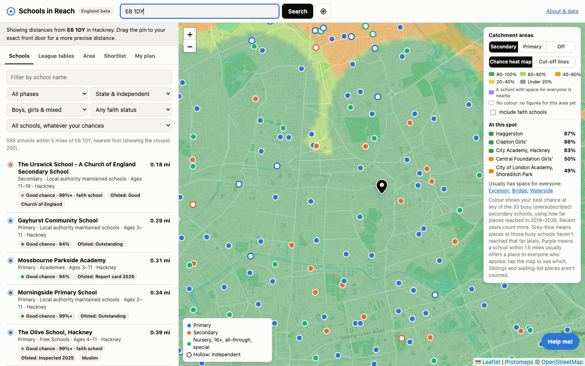
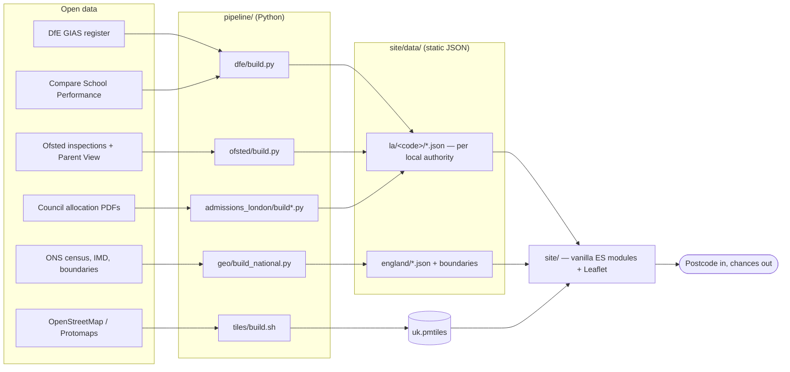

# Schools in Reach

**Choosing a school means piecing together scattered information.** Your council publishes how far places
reached last year in a PDF. The DfE publishes results in one spreadsheet, Ofsted in
another, and none of it is joined to where you actually live. The sites that do join it
up charge for it.

[www.schoolsinreach.com](https://www.schoolsinreach.com) is free, needs no sign-up, and
covers schools across England, Scotland, Wales and Northern Ireland. Type a postcode and you get the schools near you, how
far places reached at each in past years, and an honest estimate of your chances.

This repository is the whole thing: the data pipelines that build it, and the static
site that serves it.



## What it does

- **Chance heat map.** Colour shows your best chance at any oversubscribed school,
  from green (80–100%) through to yellow, worked out from published cut-off distances
  weighted towards recent years. Purple means a school nearby usually offers a place to
  everyone who applies.
- **Cut-off lines.** Each ring is one school's last distance offered, solid for every
  ability band and dashed for at least one.
- **School pages.** Admissions history, results against local and national averages,
  Ofsted (including the 2025 report cards), Parent View, finance and workforce.
- **Neighbourhood.** Deprivation, census profile, crime, stations, parks and flood risk.
- **Help me.** A six-step guide that works out your entry year from a birth month, your
  council, the deadlines, the schools worth listing, and what changes your chances.
- **My plan.** Rank up to six schools and see the likely outcome under the
  equal-preference rule, with waiting-list estimates and a dated timeline.

Everything is an estimate from published data, never a promise, and the wording in the
app says so.

## How the estimate works

Councils publish the furthest distance offered at each school, per ability band, per
year. `site/js/admissions.js` turns those into a chance curve:

- each band-year cut-off is one sample, weighted `0.75^(latest − year)` so recent years
  count most;
- a distance is scored against the weighted samples, so 3 of 4 recent years reaching you
  reads as roughly a 75% chance;
- years where everyone was offered a place count as unlimited reach;
- schools whose "cut-off" exceeds 3 miles are treated as open access, not painted as
  catchment;
- schools that select by test, measure from a nodal point, or use a catchment boundary
  are flagged instead of scored, because a straight-line distance would mislead.

Waiting-list movement uses the density of families between the cut-off and your
distance, with a Poisson tail for the chance that enough places free up.

## Architecture



The map needs no build step or framework: it uses plain ES modules, Leaflet 1.9 and
protomaps-leaflet. Data loads per local authority as you pan or search, so a visitor
downloads a couple of megabytes, not the whole country.

## Running it

```bash
# 1. Build the data (each pipeline writes into site/data/)
python3 pipeline/dfe/build.py              # schools, results, census, finance, workforce
python3 pipeline/ofsted/build.py           # inspections, report cards, Parent View
python3 pipeline/geo/build_national.py     # LSOA deprivation, stations, LA boundaries
python3 pipeline/admissions_london/build.py  # London admissions cut-offs

# 2. Build crawlable school and council pages (local data only; stdlib Python 3.9+)
python3 pipeline/seo/build_pages.py

# 3. Serve the site
cd site && python3 -m http.server 8795
# open http://127.0.0.1:8795/
```

The generated `site/data/` (about 400 MB) and the 3 GB basemap are not in this
repository; the pipelines rebuild them. `pipeline/tiles/build.sh` builds the UK
PMTiles basemap, which the live site serves from S3 behind CloudFront.

Deployment is a container of nginx plus the static site: see `deploy/railway/`.

## Admissions data

The hardest part is the admissions figures. Every council publishes "how places were
allocated" as a PDF, and no two are alike: different column names, banding schemes,
footnotes and units. `pipeline/admissions_london/` parses 24 London boroughs into one
per-school shape, with hand-checked values per borough recorded in the build reports.

Councils outside London are not done yet. The site says so where figures are missing,
rather than guessing. Contributions of a parser for your council are very welcome.

## Data sources and licensing

Built entirely from published open data, most of it under the
[Open Government Licence v3.0](https://www.nationalarchives.gov.uk/doc/open-government-licence/version/3/):

| Source | Used for |
| --- | --- |
| DfE Get Information About Schools | the school register, types, ages, locations |
| DfE Compare School Performance | Progress 8, Attainment 8, KS2 results, destinations |
| DfE school census, finance, workforce | pupil characteristics, funding, staffing |
| Ofsted management information and Parent View | inspection outcomes, report cards, parent responses |
| ONS census 2021, IMD 2025, boundaries, NSPL | neighbourhood profiles, deprivation, geography |
| Council admissions allocation reports | last distance offered, by band and year |
| postcodes.io | postcode lookups |
| data.police.uk | crime near a pin |
| OpenStreetMap contributors, via Protomaps | the basemap (ODbL) |

The code is MIT licensed (see `LICENSE`). The data belongs to its publishers under their
own licences, and the site credits them on every page that uses them.

## Not included

Pupil-level data is restricted, so this cannot show where a school's current pupils live
or which primaries feed which secondaries. That needs the National Pupil Database, which
requires a DfE application. Published cut-off distances are the honest substitute.

## Crawlable school and council pages

`pipeline/seo/build_pages.py` creates static HTML in `site/school/` and
`site/council/`, plus a sitemap index and child sitemaps. These generated paths are
ignored by Git; `site/robots.txt` and the generated shared `site/css/seo.css` remain
tracked. Edit the stylesheet's `CSS` constant in the generator, then rebuild.
The map's hash routes and JavaScript are unchanged; school-page calls to action
open the existing admissions tab.

A school is indexable only with at least two of admissions figures, substantive
Ofsted judgements (including report-card areas), headline results, or census pupil
numbers. Other open schools still have pages and council links but use
`noindex,follow` and are excluded from sitemaps. Current Scottish, Welsh and
Northern Irish bundles do not meet that two-dataset threshold. Pages distinguish
catchments and national admissions systems, and retain individual result years.

The generator reads `site/data/` without changing it. It validates and renders into
a temporary tree before replacing its generated directories, removing obsolete
URLs on rebuild. Dates in sitemaps come from dataset timestamps, not the build
clock. Run it again whenever data changes. Optional missing datasets are allowed;
a missing council register or malformed input fails the build. A school page above
26,000 bytes also fails rather than silently growing beyond the size budget.

```bash
python3 -m unittest pipeline/seo/test_build_pages.py -v
python3 pipeline/seo/build_pages.py
```

The fixture tests create their own temporary data. For another local data tree,
use `--site-dir /path/to/site` (requires `index.html` and `data/england/las.json`).
`deploy/railway/deploy.sh` builds these pages before staging with rsync and refuses
to deploy fewer than 10,000 school pages or an absent/incomplete sitemap. HTML is
served with the existing no-cache policy; sitemap XML is cached for one hour.
